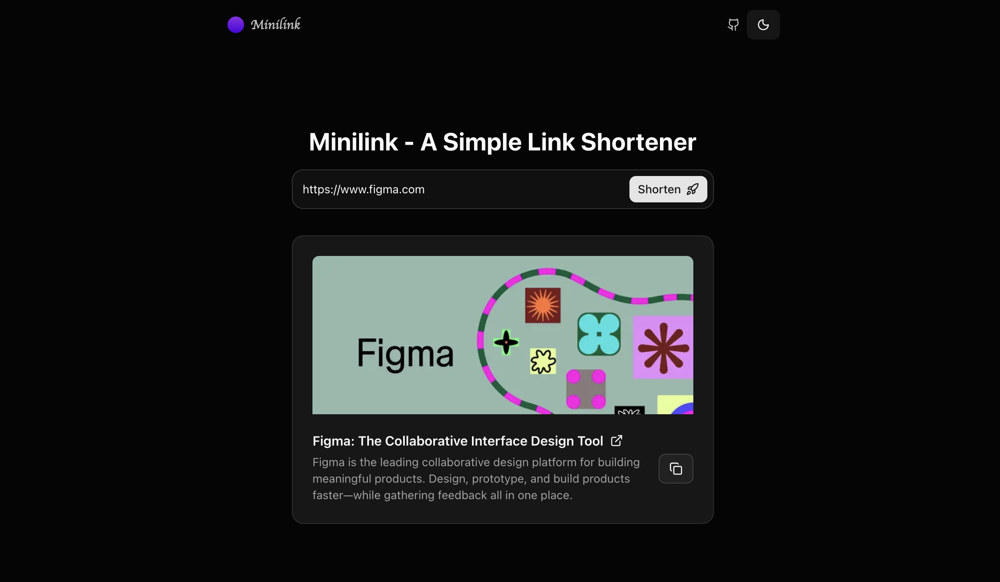

# Minilink - A Simple Link Shortener

Minilink is a minimalist link shortener built with Next.js and Bun. It offers a clean, user-friendly interface for creating and managing shortened URLs with ease.

---

## ✨ Features

- **Fast and Lightweight**: Built with Bun for blazing-fast performance.
- **Simple UI**: Minimalist design focused on usability.
- **Open Source**: Fully open-source and customizable.
- **Copy to Clipboard**: Easily copy shortened URLs with a single click.
- **Link Previews**: Displays link previews using Open Graph data.
- **Responsive Design**: Works seamlessly on both desktop and mobile devices.
- **Easy Deployment**: Ready to deploy on platforms like Vercel.

---

## 🚀 Preview

  
*A beautiful link shortner for all your needs.*

Deployed with [Vercel](https://vercel.com) at [minilink.yogeshbhutkar.com](https://minilink.yogeshbhutkar.com)

---

## 🛠️ Getting Started

1. **Clone the repository**

   ```bash
   git clone https://github.com/yogeshbhutkar/minilink.git
   cd minilink
   ```

2. **Install dependencies**

   ```bash
   bun install
   ```

3. **Run the development server**

   ```bash
   bun dev
   ```

4. **Open your browser**

   Navigate to `http://localhost:3000` to see the app in action.

---

## 📝 License

Minilink is open-source under the MIT License. Feel free to fork, tweak, and make it your own.

---

## ✨ Want a feature?

Feel free to open an issue or submit a pull request on GitHub. Contributions are welcome!

---

## ❤️ Like Minilink?

If you find Minilink useful, please give it a ⭐ on GitHub! It helps others discover the project and motivates me to keep improving it. Thank you!
